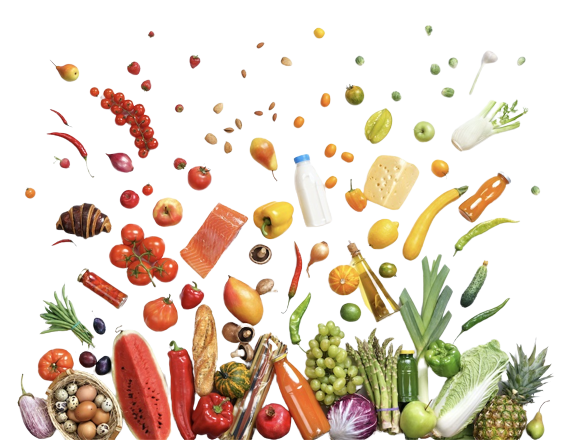

# Medi-Bot: Healthcare Chatbot, BMI Calculator, and Diet Recommendation System

Medi-Bot is a Flask-based healthcare assistant web application that combines **disease prediction through symptom analysis**, **BMI calculation**, **daily calorie estimation**, and **diet recommendation support** in a single platform.
The project is designed to help users understand possible health conditions based on symptoms, monitor body health using BMI and BMR calculations, and receive calorie-based food guidance for healthier eating habits.

---

## Table of Contents

- [Project Overview](#project-overview)
- [Problem Statement](#problem-statement)
- [Key Features](#key-features)
- [System Modules](#system-modules)
- [Tech Stack](#tech-stack)
- [Project Architecture](#project-architecture)
- [Dataset Used](#dataset-used)
- [How the System Works](#how-the-system-works)
- [Machine Learning / Disease Prediction Logic](#machine-learning--disease-prediction-logic)
- [BMI and Diet Recommendation Module](#bmi-and-diet-recommendation-module)
- [Authentication Module](#authentication-module)
- [Project Structure](#project-structure)
- [Installation and Setup](#installation-and-setup)
- [How to Run the Project](#how-to-run-the-project)
- [Sample Workflow](#sample-workflow)
- [Outputs / Screens](#outputs--screens)
- [Future Improvements](#future-improvements)
- [Limitations](#limitations)
- [Conclusion](#conclusion)

---

# Project Overview

Medi-Bot is a **web-based health assistance system** built using **Python Flask**, designed to provide users with multiple health-related utilities from a single interface.

The system includes three major healthcare functionalities:

1. **Disease Prediction Chatbot**The chatbot accepts symptoms from the user and predicts the most likely disease by comparing the entered symptoms with disease symptom data stored in the dataset.
2. **BMI and Health Monitoring**Users can calculate their **Body Mass Index (BMI)** and check their health category such as underweight, normal, overweight, or obese.
3. **Diet and Calorie Guidance**
   Based on user details like age, gender, weight, height, activity level, and fitness goal, the system estimates **BMR**, **daily calorie needs**, and suggests diet-related guidance using food data.

The main goal of this project is to create a **simple healthcare support application** that can assist users in getting basic health insights without manually checking multiple sources.

---

# Problem Statement

Due to busy lifestyles, many people ignore basic health monitoring such as:

- identifying possible diseases from symptoms
- checking whether their weight is healthy
- tracking calorie requirements
- understanding what food intake is suitable for their health goals

Medi-Bot addresses this by combining **symptom-based disease prediction**, **BMI analysis**, and **diet support** in one system.

---

# Key Features

## 1) Disease Prediction Chatbot

- Accepts symptom input from the user
- Matches symptoms with known disease patterns from the dataset
- Returns the most likely disease prediction
- Provides a chatbot-based interaction for better usability

## 2) BMI Calculator

- Calculates Body Mass Index using:

```text
BMI = Weight (kg) / Height² (m²)
```

- Classifies BMI into:
  - Underweight
  - Normal
  - Overweight
  - Obese

## 3) BMR and Daily Calorie Estimation

- Calculates **Basal Metabolic Rate (BMR)**
- Estimates **Total Daily Energy Expenditure (TDEE)** based on activity level
- Supports:
  - weight loss calorie target
  - weight gain calorie target
  - weight maintenance calorie target

## 4) Food and Diet Recommendation Support

- Uses a food dataset to provide calorie-related food guidance
- Helps users understand how food intake can align with health goals

## 5) User Authentication

- Login and registration support
- Stores user credentials in a local SQLite database

## 6) Web-Based Interface

- User-friendly frontend built with HTML, CSS, Bootstrap, and JavaScript
- Multiple pages for home, BMI, login, registration, chatbot, and disease utilities

---

# System Modules

## 1. Authentication Module

Handles:

- user registration
- login validation
- session-based access control

## 2. Disease Prediction Module

Handles:

- symptom input processing
- symptom matching
- disease prediction using similarity-based logic

## 3. BMI Module

Handles:

- BMI calculation
- BMI category identification

## 4. User Health Module

Handles:

- user profile information
- BMR calculation
- calorie estimation
- health goal based calorie adjustment

## 5. Food Recommendation Module

Handles:

- food dataset reading
- food grouping / calorie assistance
- diet support logic

## 6. Frontend Module

Handles:

- home page
- chatbot interface
- disease list page
- BMI page
- login and registration pages

---

# Tech Stack

## Backend

- **Python**
- **Flask**

## Frontend

- **HTML**
- **CSS**
- **Bootstrap**
- **JavaScript**
- **jQuery**

## Database

- **SQLite**

## Data Processing / Logic

- **Pandas**
- **NumPy**
- **scikit-learn** *(if used in preprocessing / analysis notebooks)*
- **Cosine Similarity / Symptom Matching logic**

## Visualization / Analysis

- **Matplotlib**
- **Seaborn**

---

# Project Architecture

```text
User
  ↓
Frontend (HTML/CSS/Bootstrap/JS)
  ↓
Flask Application
  ├── Authentication Logic
  ├── Disease Prediction / Chatbot Logic
  ├── BMI & BMR Logic
  ├── Food Recommendation Logic
  └── Database / CSV / Excel Dataset Access
```

---

# Dataset Used

## 1) Disease Dataset

The disease prediction module uses symptom-based disease data where:

- each disease is associated with a set of symptoms
- symptoms are transformed into a structured form
- the user’s entered symptoms are compared with known disease symptom patterns

Files in the project include:

- `dataset.xlsx`
- `dataset.xls`
- training/testing CSVs related to disease symptoms

## 2) Food Dataset

The project also uses a food list dataset such as:

- `food_list.csv`

This dataset is used to support:

- food-based calorie guidance
- diet recommendation
- health goal related food suggestions

---

# How the System Works

## A) Disease Prediction Chatbot Flow

1. User enters symptoms in the chatbot interface.
2. System preprocesses and normalizes the symptom text.
3. Symptoms are matched against disease symptom patterns in the dataset.
4. The most likely disease is returned to the user.

## B) BMI Calculation Flow

1. User enters height and weight.
2. System calculates BMI.
3. BMI category is displayed as Underweight / Normal / Overweight / Obese.

## C) Calorie / Diet Flow

1. User enters age, gender, height, weight, activity level, and goal.
2. System calculates:
   - BMR
   - daily calories
   - calorie change required for weight gain/loss/maintenance
3. Food / diet suggestions are displayed based on the target.

---

# Machine Learning / Disease Prediction Logic

The healthcare chatbot uses a **symptom-based disease prediction approach**.

### Core idea

- The dataset contains diseases and their associated symptoms.
- User-entered symptoms are compared with the dataset symptom patterns.
- Similarity-based matching is used to identify the most likely disease.

### Typical flow

- symptom cleaning / normalization
- symptom vector or keyword mapping
- similarity comparison
- highest matching disease returned as prediction

This approach is useful for building an **interactive first-level health assistant** that can guide users before they seek clinical consultation.

> **Note:** This system is for educational / assistance purposes and should not be treated as a substitute for professional medical diagnosis.

---

# BMI and Diet Recommendation Module

The BMI and diet module uses user health information to estimate body condition and calorie needs.

## BMI

BMI is calculated using:

```text
BMI = Weight (kg) / Height² (m²)
```

## BMR

The application estimates BMR using gender-specific formulas and then computes daily calorie needs based on activity level.

## Activity Levels

The project supports activity-based calorie calculation such as:

- sedentary
- lightly active
- moderately active
- very active
- extra active

## Weight Goal Support

The user can choose:

- **loss**
- **gain**
- **maintain**

Based on the goal, the system adjusts calorie targets and supports diet planning.

---

# Authentication Module

The application includes a login / registration system for user access.

## Features

- user registration page
- login page
- form validation
- credential storage using SQLite database
- separate UI templates for authentication

This makes the project closer to a **full web application** rather than a standalone ML script.

---

# Project Structure

```text
Healthcare_ChatBot/
│
├── app.py / main Flask app
├── database.db
├── dataset.xls
├── dataset.xlsx
├── requirements
├── feature_correlation.png
│
├── classes/
│   ├── User.py
│   ├── Food.py
│   └── Report.py
│
├── templates/
│   ├── base.html
│   ├── base_login.html
│   ├── index.html
│   ├── login.html
│   └── register.html
│
├── static/
│   ├── css/
│   ├── js/
│   ├── img/
│   ├── custom/
│   ├── profile/
│   ├── fonts/
│   ├── vendor/
│   └── chatbot assets
│
└── README.md
```

> The exact structure may vary slightly depending on your local version of the project.

---

# Installation and Setup

## 1) Clone the repository

```bash
git clone <your-repository-link>
cd Healthcare_ChatBot
```

## 2) Create a virtual environment

### Windows

```bash
python -m venv venv
venv\Scripts\activate
```

### macOS / Linux

```bash
python3 -m venv venv
source venv/bin/activate
```

## 3) Install dependencies

If you have a `requirements.txt` file:

```bash
pip install -r requirements.txt
```

If the project file is named `requirements` instead of `requirements.txt`, either rename it or install with:

```bash
pip install -r requirements
```

## 4) Ensure datasets and database are present

Make sure these files are available in the project root if your code expects them:

- `dataset.xls`
- `dataset.xlsx`
- `database.db`

---

# How to Run the Project

Start the Flask application:

```bash
python app.py
```

Then open the local server URL in your browser, typically:

```text
http://127.0.0.1:5000/
```

If your Flask file uses a different port or entry point, use that accordingly.

---

# Sample Workflow

## Example 1: Disease Prediction

**Input symptoms:** fever, headache, vomiting
**System output:** predicted disease based on highest symptom similarity

## Example 2: BMI Calculation

**Input:** height = 170 cm, weight = 75 kg
**System output:** BMI + health category

## Example 3: Diet Support

**Input:** age, gender, height, weight, activity level, goal
**System output:** daily calories + calorie target + diet guidance

---

# Outputs / Screens

You can add screenshots of the following pages here:

- Home page
- Chatbot interface
- Disease prediction page
- BMI calculator page
- Login page
- Register page
- Diet / calorie report output

Example:

```md
## Screenshots

### Home Page


### Chatbot Interface
Add chatbot screenshot here

### BMI Calculator
Add BMI screenshot here
```

---

# Future Improvements

This project can be improved further by adding:

- **real ML classification models** for disease prediction
  - Random Forest
  - XGBoost
  - SVM
  - Neural Networks
- **NLP-based symptom extraction** from free-text user messages
- **hospital recommendation using geolocation / maps API**
- **doctor consultation booking**
- **medical history tracking**
- **PDF report generation**
- **user dashboard with saved predictions**
- **diet personalization using nutrition analytics**
- **deployment on Render / Railway / Heroku / AWS**

---

# Limitations

- The chatbot provides **basic symptom-based disease suggestions**, not medical diagnosis.
- Accuracy depends heavily on:
  - dataset quality
  - symptom coverage
  - matching logic used
- It does not replace a doctor or laboratory diagnosis.
- Hospital recommendation logic may require richer location-based integration for real-world use.
- Diet recommendations can be made more personalized using nutritional constraints and user history.

---

# Conclusion

Medi-Bot is a **multi-feature healthcare web application** that combines:

- **disease prediction**
- **chatbot interaction**
- **BMI calculation**
- **BMR and calorie estimation**
- **diet guidance**
- **user authentication**

into one integrated Flask project.

This project demonstrates the practical integration of **web development, healthcare data handling, basic intelligent prediction logic, and user-centric design**. It is a strong academic / portfolio project because it goes beyond a single ML model and builds a **complete health-assistance platform** with multiple interconnected modules.

---

# Author

**Milind Chavan**

If you use this project for learning or improvement, feel free to fork it and build additional healthcare features on top of it.
